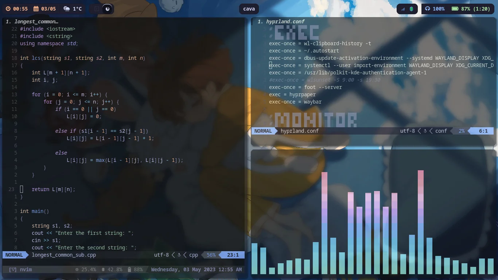

# Maxis Linux

Maxis Linux is a custom Arch-based Linux distribution focused on a clean live
environment and a custom installer workflow.

This repository contains the ArchISO profile, live filesystem customizations,
boot configuration, and installer assets used to build the ISO image.

## Preview

## Highlights

- Arch Linux base with `pacman` ecosystem
- Custom live environment under `airootfs/`
- Integrated Maxis installer
- Calamares modules and post-install scripts
- Custom branding and boot assets

## Repository layout

- `airootfs/`: files copied into the live system root
- `packages.x86_64`: packages included in the ISO
- `profiledef.sh`: ArchISO profile metadata and build settings
- `pacman.conf`: package manager configuration for ISO build
- `efiboot/`, `grub/`, `syslinux/`: bootloader configs
- `local/repo/`: local package repository used during build

## Download

Latest published ISO:
[Download Maxis Linux ISO](https://zsnr2wolomin-my.sharepoint.com/:f:/g/personal/krawczyk_maksymilian_sp2wolomin_edu_pl/IgDfJZ-44FsaR7SlBnNUHN46AeCmd9WlizzUD9rJ4MLa9PA?e=HWw1Rw)

## Status

The project is under active development and may contain bugs.

## License

This project is open source and licensed under the terms in
[LICENSE](./LICENSE).
